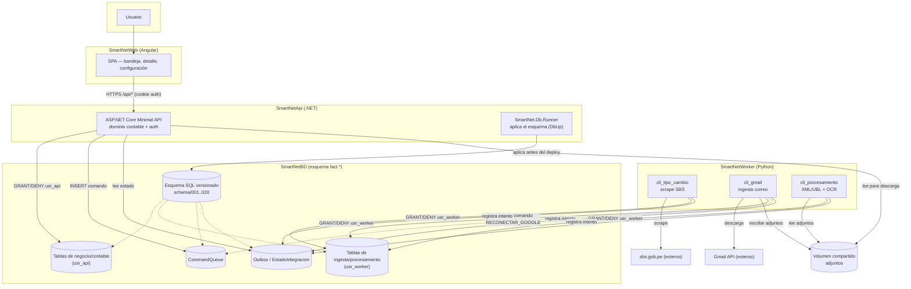

# SmartNet — Mapa del ecosistema

Este documento es el mapa general del ecosistema **SmartNet** (Gestor de Facturas de Compra). Cada
subcarpeta de primer nivel se trata como un repositorio independiente del ecosistema, con su propio
rol, stack y ciclo de vida — aunque hoy conviven en el mismo repositorio git de nivel superior. El
detalle interno de cada uno (comandos, convenciones, gotchas) vive en el `CLAUDE.md` de esa
subcarpeta, no aquí.

## Repos del ecosistema

| Repo | Rol | Stack | Depende de |
|---|---|---|---|
| `SmartNetBD` | Contrato de datos: esquema SQL versionado, permisos por rol, fixtures de catálogo externo | Scripts SQL Server numerados + DbUp | — (es la base; nadie depende de que él dependa de algo) |
| `SmartNetApi` | Backend HTTP transaccional: dominio contable, autenticación, endpoints de la SPA, aplicador del esquema | .NET 10, ASP.NET Core Minimal API, ADO puro (`Microsoft.Data.SqlClient`) | `SmartNetBD` (esquema + tablas `fact.*`) |
| `SmartNetWorker` | Ingesta y procesamiento asíncrono: tipo de cambio (SBS), correo (Gmail), extracción XML/OCR | Python 3.13, `pyodbc`, `google-api-python-client`, `pytesseract` | `SmartNetBD` (mismo esquema, tablas de ingesta/procesamiento) |
| `SmartNetWeb` | SPA de bandeja de documentos, detalle de factura, configuración | Angular 22 (signals, sin librería de estado), Vitest | `SmartNetApi` (único consumidor de `/api/*`) |

## Contratos compartidos entre repos

### 1. El esquema SQL es el contrato de integración (no HTTP)

`SmartNetApi` y `SmartNetWorker` **nunca se llaman entre sí por HTTP**. Se comunican exclusivamente
a través de tablas compartidas en `SmartNetBD`:

- **CommandQueue** — la API encola comandos (`POST /api/integraciones/google/reconectar` inserta un
  comando `RECONECTAR_GOOGLE`) que el worker consume y ejecuta de forma asíncrona.
- **Outbox / EstadoIntegracion** — el worker registra resultado de cada intento de integración
  (`Nombre='SBS'`, `'GMAIL'`, `'WORKER'`) que la API lee para exponer `GET
  /api/integraciones/estado`.
- **Partición de propiedad de datos**: cada runtime tiene su propio login de base de datos
  (`usr_api` / `usr_worker`) con `GRANT` sobre sus tablas y **`DENY` explícito cruzado** sobre las
  del otro — así que ni siquiera un bug de código puede violar el límite en tiempo de ejecución.

El esquema (`SmartNetBD/schema/`) es versionado y aplicado por `SmartNet.Db.Runner` (dentro de
`SmartNetApi/db/`) vía DbUp, siempre **antes** de desplegar la API o el worker. Ninguno de los dos
genera ni migra el esquema (nunca EF Core, nunca Alembic).

### 2. HTTP entre SPA y API

`SmartNetWeb` es el único cliente HTTP de `SmartNetApi`, bajo el prefijo `/api/*`
(`proxy.conf.json` en desarrollo → `https://localhost:54848`). Autenticación por cookie de sesión
server-side; sin CORS porque en producción ambos quedan detrás de un mismo proxy inverso y mismo
origen (ver Despliegue).

Endpoints principales: sesión/login, `Asiento`, `Auditoria`, `Bandeja`, `Catalogo`,
`Configuracion`, `Documento`, `Factura`, `Integracion`, `TipoCambio`.

### 3. Volumen compartido de archivos

`SmartNetWorker` escribe los adjuntos descargados (PDF/XML de Gmail) en una raíz compartida
(`SMARTNET_WORKER_STORAGE_ROOT`); `SmartNetApi` lee de esa misma raíz para servir la descarga. Es
el único contrato del ecosistema que no pasa por SQL.

## Arquitectura de alto nivel

**Quién es cliente de quién:**
- `SmartNetWeb` es cliente HTTP de `SmartNetApi` (único consumidor de `/api/*`).
- `SmartNetApi` y `SmartNetWorker` son pares que se comunican de forma asíncrona a través de
  `SmartNetBD` (CommandQueue/Outbox) — **ninguno es cliente HTTP del otro**.
- `SmartNetApi` y `SmartNetWorker` son ambos clientes de datos de `SmartNetBD`, cada uno con su
  login y su porción del esquema.
- `SmartNetBD` no depende de ningún otro repo; es el contrato que los demás consumen.

## Despliegue

No hay contenedores (`Dockerfile`/`docker-compose` deliberadamente descartados por
desproporcionados) ni pipeline de despliegue en CI (el único workflow es de pruebas). La topología
prevista está documentada en el ADR "topología de despliegue y TLS" del repo raíz:

- Un único origen detrás de un **proxy inverso**: `/` sirve el build estático de `SmartNetWeb`,
  `/api/*` enruta a Kestrel (`SmartNetApi`) — sin CORS.
- TLS se termina en el proxy inverso; Kestrel solo escucha en la red interna del host.
- Orden de despliegue: 1) `SmartNet.Db.Runner` (esquema) → 2) `SmartNetApi` → 3) `SmartNetWorker`.
- `SmartNetWorker` no tiene proceso propio ni scheduler embebido: la recurrencia (cron/Task
  Scheduler) es responsabilidad del entorno de despliegue, fuera del código.
- Pendiente sin resolver en el ADR: origen y renovación del certificado TLS.

El host físico/VM concreto y el proxy inverso específico no están decididos ni documentados aún.
